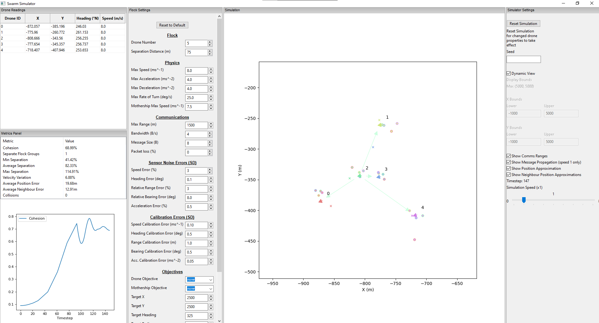

# COMP6200 Swarm 2021

A tool for running simulations of underwater flocking behaviours.
<p align="center"></p>

This tool was developed for COMP6200: Group Design Project 2021/22 - Group 7.

## How to Use

### Dependencies

 + Python 3.9.6 (wx not supported on 3.10.1 at time of writing)
   + cycler==0.11.0
   + fonttools==4.29.0
   + kiwisolver==1.3.2
   + matplotlib==3.5.1
   + numpy==1.22.1
   + packaging==21.3
   + pandas==1.4.0
   + Pillow==9.0.0
   + pyparsing==3.0.7
   + python-dateutil==2.8.2
   + pytz==2021.3
   + six==1.16.0
   + wxPython==4.1.1

These dependencies are listed in `requirements.txt`, and can therefore be installed quickly using the following:

```
pip install -r requirements.txt
```

Tested on Windows 10

### GUI Client
The GUI version of the tool can be started by running window.py
```
python ./window.py
```

### Headless Client
The the tool can run without the GUI using headless_runner.py.
```
python ./headless_runner.py --steps <STEPS>
```
The headless runner can be used to specify all of the same settings available in the GUI version as command-line parameters.
<details>
<summary> <b>Click to expand settings</b> </summary>

 + `--steps` - Duration of simulation
 + `--samples` - Number of simulations to run
 + `--seed` - Seed for random elements of simulation
 + `--flock_size` - Number of drones
 + `--max_speed` - (ms^-1)
 + `--max_acceleration` - (ms^-2)
 + `--max_deceleration` - (ms^-2)
 + `--max_rate_of_turn` - (degrees s^-1)
 + `--mothership_max_speed` - (ms^-1)
 + `--max_range` - (m)
 + `--bandwidth` - Number of bytes sent per second
 + `--message_size` - Size of messages in bytes
 + `--packet_loss` - Percentage of messages not received
 + `--speed_error` - S.D of noise error of speed sensor (%)
 + `--heading_error` - S.D of noise error of heading sensor (degrees)
 + `--range_error` - S.D of noise error of message range sensor (%)
 + `--bearing_error` - S.D of noise error of message bearing sensor (degrees)
 + `--acceleration_error` - S.D of noise error of acceleration sensor (%)
 + `--speed_calibration_error` - S.D of calibration error of speed sensor (ms^-1)
 + `--heading_calibration_error` - S.D of calibration error of heading sensor (degrees) 
 + `--range_calibration_error` - S.D of calibration error of message range sensor (m)
 + `--bearing_calibration_error` - S.D of calibration error of message bearing sensor (degrees)
 + `--acceleration_calibration_error` - S.D of calibration error of acceleration sensor (ms^-2)
 + `--separation_distance` - Intended distance between drones (m)
 + `--drone_objective` - Task for general drones
   + *NONE, TARGET_MOTHERSHIP, FOLLOW_CIRCLE, FIXED_HEADING,TARGET_POINT*
 + `--mothership_objective` - Task for single mothership
   + *NONE, FOLLOW_CIRCLE, TARGET_POINT*
 + `--target_x` - X coord of objective target/circle (m)
 + `--target_y` - Y coord of objective target/circle (m)
 + `--target_radius` - Radius of objective circle (m)
 + `--target_heading` - Bearing of heading objective (degrees)
 + `--weight_separation` - Drone control vector weight for separation
 + `--weight_alignment` - Drone control vector weight for alignment
 + `--weight_cohesion` - Drone control vector weight for cohesion
 + `--weight_objective` - Drone control vector weight for goal vector
</details>

e.g.
```
python ./headless_runner.py --steps 10000 --drone_objective FOLLOW_CIRCLE --packet_loss 50
```

Data will be output to `./out/` in a directory named using the current date and time `YYYY-MM-DDThh_mm` (`_index`) in a number of CSV files.

Single sample runs will output:
 + `metadata.csv` - input settings
 + `metrics_log.csv` - computed performance metrics
 + `raw_data_log.csv` - raw drone position table

Multi-sample runs will output:
 + `metadata.csv` - input settings
 + `metrics_log_max.csv` - max of metrics across all runs
 + `metrics_log_min.csv` - min of metrics across all runs
 + `metrics_log_mean.csv` - mean of metrics across all runs
 + `metrics_log_std.csv` - standard deviation of metrics across all runs


## Testing
The full test suite can be run using
```
python ./test_runner.py
```